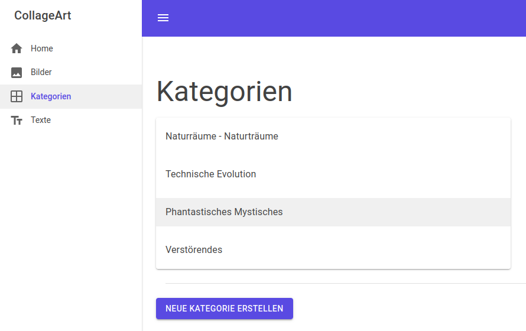
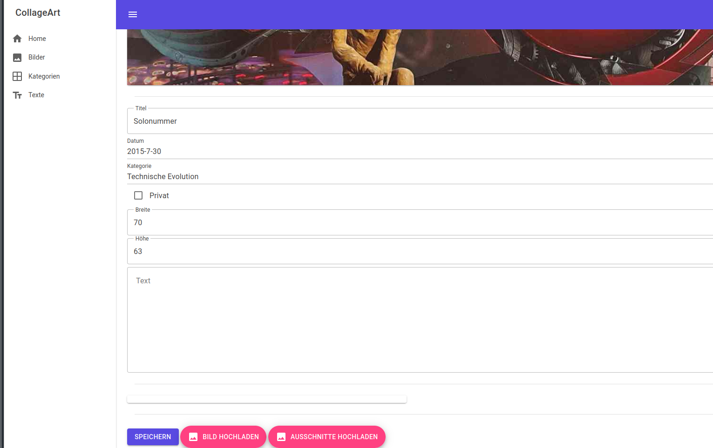

# Collage Art

Collage Art is a simple Blazor-Server App that allows the creation of a static Website, meant to show off your personal gallery of collages.

It's features include:

* Creation of categories to organize your collages.

  

* Uploading images and adding meta data to display in the art gallery.

  

* Adding and editing texts on the website.

An example for the resulting website can be found <a href="https://collageart-ducheyne.eu/">here</a>.